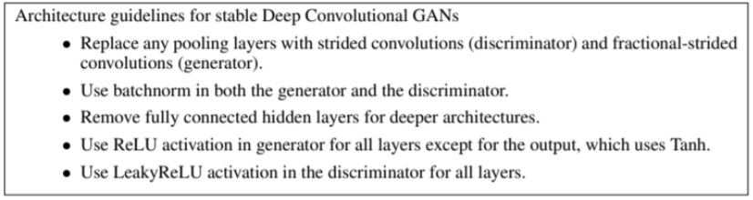
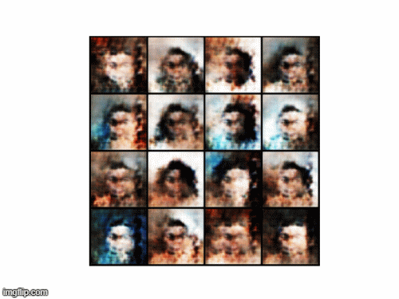
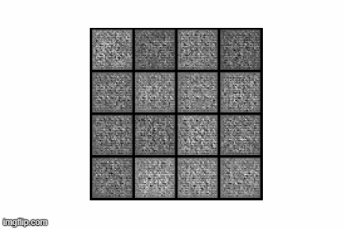
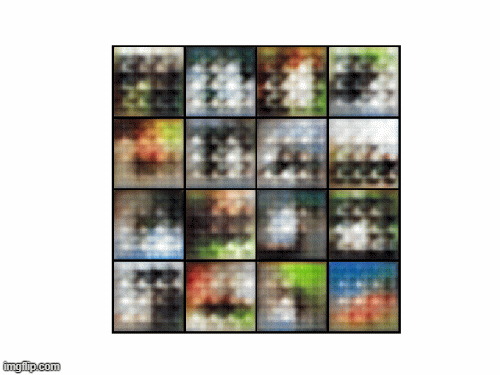
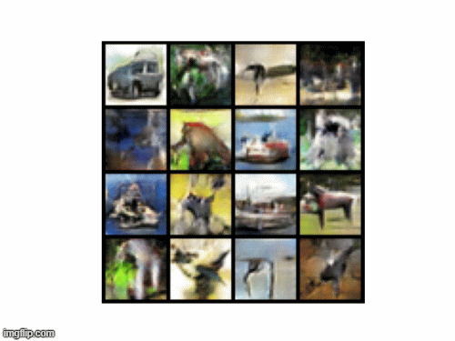

# Deep Convolutional Generative Adversarial Networks

A Generative Adversarial Network (GAN) is a machine learning technique in the set of generative models. Given a training set, networks can learn the probability distribution of classes and generate new data using those statistics. The method is applied in a game-theoretical manner. The proposed structure contains two models. The generative model can be thought of as analogous to a painter that learns how to paint from scratch, while the discriminator model can be thought of as a critic that guides the new learner to improve[1]. As time goes, both of them improve from each other.

DCGAN is a variant of GANs that utilizes convolutional layers for feature extraction in the discriminator, and transposed convolution layers for image creation in the generator. In this repository, DCGAN is applied to CIFAR-10 [3], MNIST [4] and CelebA [5] datasets using PyTorch machine learning library.

## Methodology

The aim of the generator is to take a high dimensional vector (z) that is randomly sampled from Gaussian distribution, and map into image space (G(z) = x). The discriminator is used to distinguish whether the discriminator input is real or generated. It outputs a value D(x) to estimate the chance that the input is real.

The method that is proposed in Unsupervised Representation Learning with Deep Convolutional Generative Adversarial Networks is adopted.

  

Using strided convolutions enables models to learn its own spatial downsampling deterministically, and batch normalization in addition to removing fully connected layers are for having a better gradient flow through the networks.

## Models

- convDCGAN: 5 convolutional layered Discriminator and 5 transposed convolutional layered Generator (to MNIST, CelebA and CIFAR-10)

- linDCGAN: A discriminator that has 4 convolutional and a linear layer layered, and 3 transposed convolutional and a convolutional layered Generator (to CIFAR-10)

- classDCGAN: 5 convolutional layered Discriminator and 5 transposed convolutional layered Generator where each class has a single generator and discriminator pair (to CIFAR-10)

Batch normalization is used after each layer for all models with LeakyReLU of alpha 0.1 for the discriminators while the generators use standard ReLU. It is chosen to apply (4,4) filters with stride 2 and padding 1, so that the number of pixels are either upsampled or downsampled  by a factor of 4 in each layer in order to mutate the image size in our favor. ADAM optimizer is used with a constant learning rate 0.0002, beta1 0.5 and beta2 0.999. Since the number of epochs that are required for the training process is too much, the learning rate is kept relatively small. Batch size is 128 and loss function is the binary cross-entropy loss (since the discriminator chooses only fake or real, binary classification). 

All the experiments in the report are performed in NVIDIA GeForce GTX 850m, with 600 CUDA cores.

### CelebA

  

### MNIST

  

### CIFAR-10

**Conv Model**

  

**Linear Model**

  

**Class DCGAN**

 

 

 

 

 

